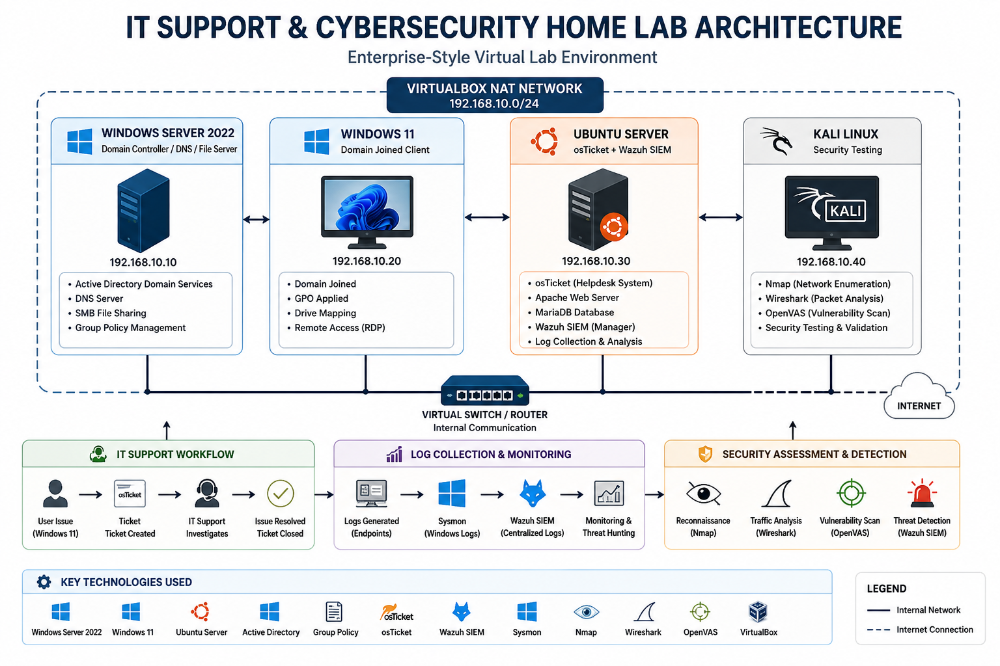

# IT Support & Cybersecurity Home Lab

## Lab Architecture

A hands-on enterprise-style IT Support and Cybersecurity home lab built to simulate real-world IT administration, helpdesk operations, endpoint monitoring, vulnerability management, and SOC (Security Operations Center) workflows.

This project demonstrates practical experience with Windows Server administration, Active Directory, Group Policy, Linux administration, helpdesk systems, vulnerability scanning, endpoint monitoring, SIEM deployment, and threat hunting.

---

# Lab Overview

## Lab Environment

| System | Role | IP Address |
|---------|------|-------------|
| Windows Server 2022 | Domain Controller / DNS / File Server | 192.168.10.10 |
| Windows 11 | Domain Joined Client | 192.168.10.20 |
| Ubuntu Server | osTicket + Wazuh SIEM | 192.168.10.30 |
| Kali Linux | Security Testing | 192.168.10.40 |

---

# Technologies Used

## Infrastructure & Administration

- Windows Server 2022
- Windows 11
- Ubuntu Server
- Active Directory
- DNS
- SMB File Sharing
- VirtualBox
- PowerShell
- Linux CLI

## IT Support & Helpdesk

- osTicket
- Ticket Troubleshooting
- Service Management
- User Support
- System Administration

## Cybersecurity & Monitoring

- Wazuh SIEM
- Sysmon
- OpenVAS
- Wireshark
- Nmap
- Kali Linux
- Threat Hunting
- Security Monitoring
- Windows Event Logs

---

# Project Modules

## 1. Network Foundation

Configured enterprise-style virtual infrastructure using VirtualBox with networking, remote access, and shared resources.

### Skills Demonstrated

- Network troubleshooting
- Remote access
- Drive mapping
- Connectivity testing
- Virtual networking

### Screenshots

#### Lab Setup

---

## 2. Active Directory & Group Policy

Built a Windows domain environment using Windows Server 2022 and configured Group Policy Objects (GPOs).

### Skills Demonstrated

- Active Directory administration
- Domain management
- Group Policy
- Drive mapping
- User administration

### Screenshots

#### Drive Mapping

#### Remote Connection

#### Week Progress

---

## 3. Helpdesk Ticketing System (osTicket)

Deployed and configured osTicket on Ubuntu Server to simulate real enterprise IT support ticket workflows.

### Skills Demonstrated

- Linux Administration
- Apache Troubleshooting
- MariaDB Configuration
- Helpdesk Operations
- Ticket Resolution

### Screenshots

---

## 4. Network Security Analysis

Performed vulnerability scanning, traffic analysis, and network enumeration using cybersecurity tools.

### Tools Used

- OpenVAS
- Wireshark
- Nmap

### Skills Demonstrated

- Vulnerability Assessment
- Packet Analysis
- Network Enumeration
- Threat Identification

### Screenshots

---

## 5. Endpoint Monitoring with Sysmon

Configured Sysmon to collect endpoint telemetry for process monitoring, PowerShell analysis, and network visibility.

### Skills Demonstrated

- Windows Event Monitoring
- PowerShell Analysis
- Network Traffic Analysis
- Threat Hunting

### Screenshots

---

## 6. Wazuh SIEM Monitoring

Implemented centralized monitoring and threat hunting using Wazuh SIEM.

### Skills Demonstrated

- SIEM Administration
- Endpoint Monitoring
- Threat Hunting
- Security Event Analysis

### Screenshots

---

## 7. Attack Simulation & Detection

Simulated attacker behavior and investigated detections using Wazuh SIEM.

### Detection Scenarios

- Reconnaissance Detection
- Persistence Monitoring
- Lateral Movement Detection
- Threat Investigation

### Screenshots

---

# Skills Demonstrated

## IT Support

- Active Directory
- Group Policy
- Helpdesk Troubleshooting
- Ticket Management
- Windows Administration
- Linux Administration
- DNS Troubleshooting
- SMB File Sharing

## Cybersecurity

- SIEM Monitoring
- Threat Hunting
- Sysmon Monitoring
- Vulnerability Management
- Security Event Analysis
- Incident Investigation
- PowerShell Monitoring
- Endpoint Security

---

# Author

**Harsh Patel**  
Cybersecurity & IT Support Professional  
Ontario, Canada
